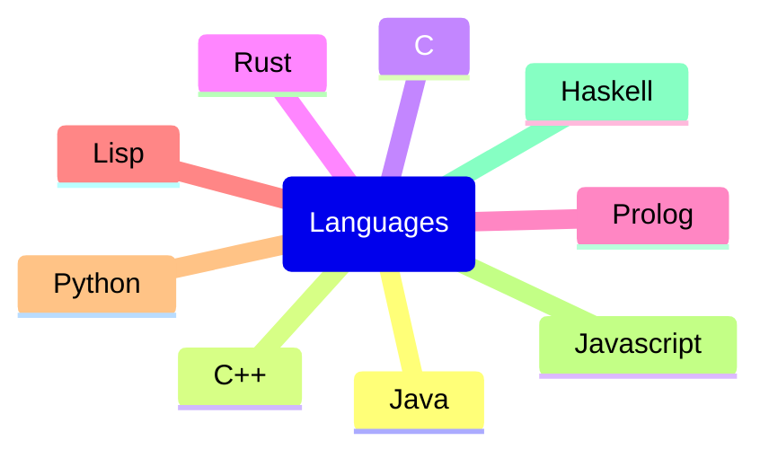
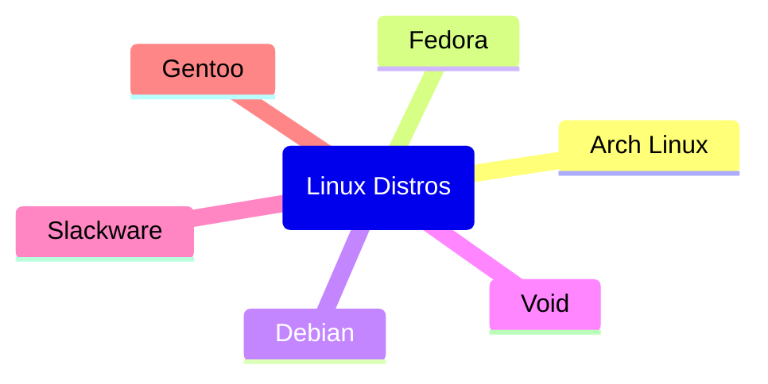
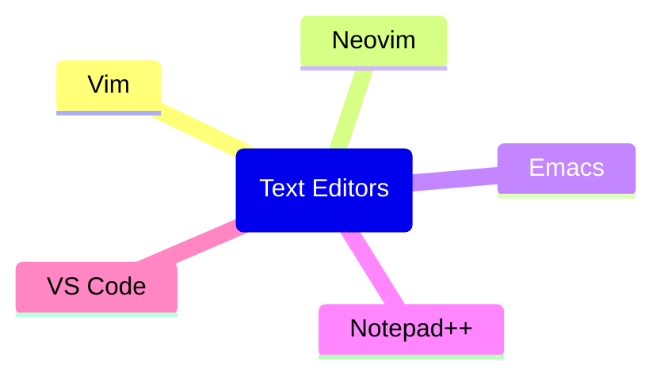
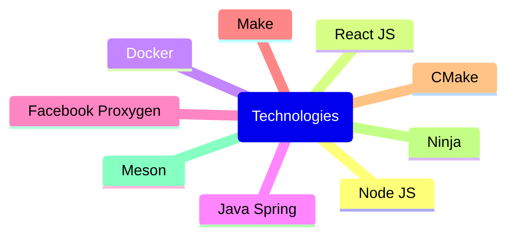

# windflaag

## Bio

- 👋 Hi, I’m Francesco Refolli
- 👀 I’m interested in Computer Science and Railways
- 🌱 I’m currently on 3rd year of Bachelor's Degree in Computer Science at Universita' degli studi di Milano Bicocca
- 💞️ I’m looking to add java.util.Scanner.nextChar() method

## Languages

## Linux Distros

## Text Editors

## Technologies

## Stats

  <table width="100%">
    <tr><td></td></tr>
    <tr><td></td></tr>
    <tr><td></td></tr>
  </table>

