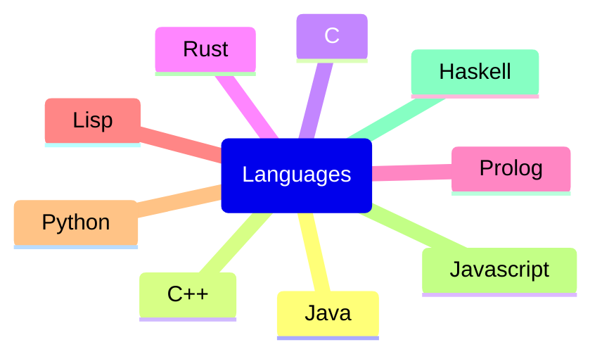
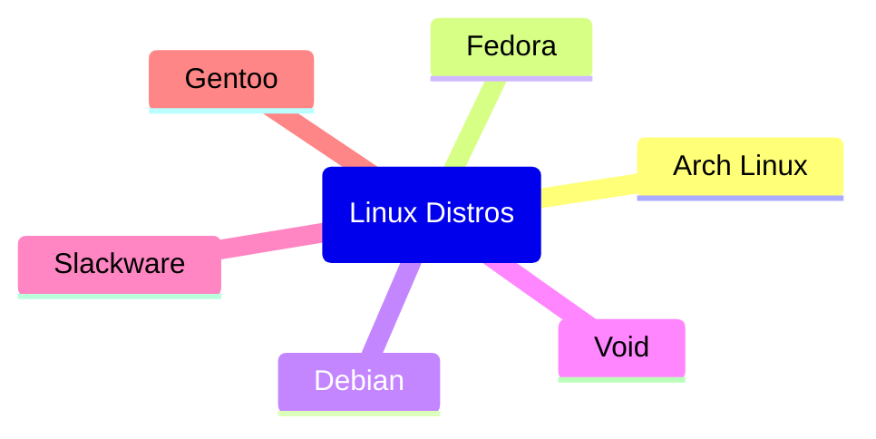
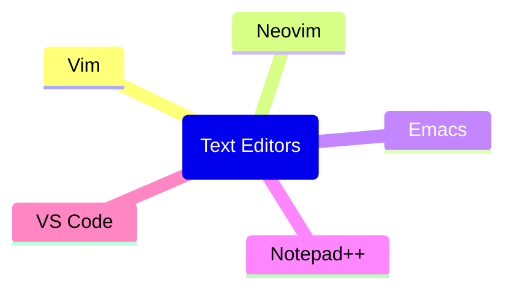
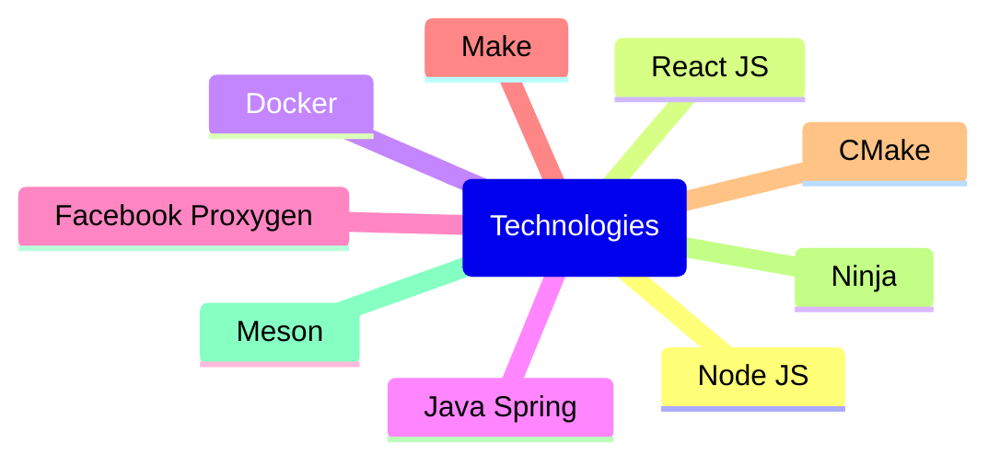

## Languages

```mermaid
mindmap
  root(Languages)
    Java
    C++
    C
    Rust
    Prolog
    Lisp
    Python
    Javascript
    Haskell
```

## Linux Distros

```mermaid
mindmap
  root(Linux Distros)
    Arch Linux
    Fedora
    Debian
    Void
    Slackware
    Gentoo
```

## Text Editors

```mermaid
mindmap
  root(Text Editors)
    Vim
    Neovim
    Emacs
    Notepad++
    VS Code
```

## Technologies

```mermaid
mindmap
  root(Technologies)
    Node JS
    React JS
    Docker
    Java Spring
    Facebook Proxygen
    Make
    CMake
    Ninja
    Meson
```

#Stats

  <table>
    <tr></tr>
    <tr></tr>
    <tr></tr>
  </table>

